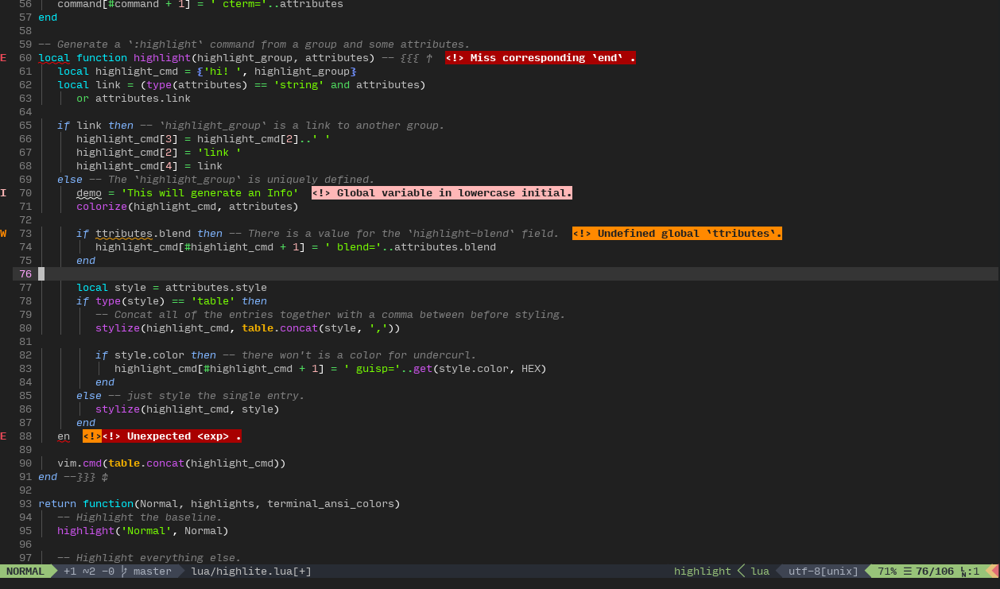

# Default Settings Preview



# Introduction

`nvim-highlite` is a colorscheme template repository for Neovim 0.5+.

This template's _defaults_ focus on:

1. Compatability with [semantic highlighting](https://medium.com/@evnbr/coding-in-color-3a6db2743a1e).
	* I was using colorschemes that often did not provide enough highlight groups to provide distinction between tokens.
2. Visibility in any range of blue-light.
	* I use `redshift` often, and many colorschemes did not allow for me to see when I had lower color temperatures.

This template's _design_ focuses on:

1. Ease of use and rapid development.
	* New features may simply be integrated with current configurations, rather than rewritten over them.
	* Merging with the upstream repository is simplified by GitHub, allowing you to select what new defaults to add.
	* It provides a large supply of defaults for plugins and programming languages.
		* Define a smaller set of "categorical" highlights (see Neovim's `group-name` help page) and many more will `link` automatically.
2. Inversion of Control
	* Changes made to the highlighting algorithm won't affect how you write your colorscheme.
	* New highlight group attributes which are unaccounted for in older versions will simply be ignored without errors due to Lua's `table`s.

# Prerequisites

1. Neovim 0.5+

# Installation

## Creating Your Own

1. Fork this repository, or clone it with `git clone https://github.com/Iron-E/nvim-highlite`.
2. Follow the instructions in [`colors/highlite.vim`](colors/highlite.vim).
	* If you are on a Unix system, use the [setup script](setup.sh) like so:
	```sh
	chmod +x ./setup.sh
	./setup.sh highlite <colorscheme>
	```
	Where `<colorscheme>` is the name of your desired colorscheme.
	* If you are on Windows, rename the files manually.

## Just The Defaults

1. Install a plugin manager such as [`vim-plug`](https://github.com/junegunn/vim-plug) and use it to "plug" this repository.
	```viml
	" vim-plug example
	Plug "Iron-E/nvim-highlite"
	```
2. Specify this colorscheme as your default colorscheme in the `init.vim`:
	```viml
	" Enable 24-bit color output. Only do this IF your environment supports it.
	" This plugin is fully compatible with 8-bit, 16-bit, and 24-bit colors.
	set termguicolors
	" Use the colorscheme
	colorscheme highlite
	```

# Usage

## Examples

This repository in itself is an example of how to use `nvim-highlite`. Aside from this, the following colorschemes are built using `nvim-highlite`:

* (if you use this, open an issue and I'll add it here!)

### As Dependency

Below is an example of how to use `nvim-highlite` as a dependency.

* See `:h highlite-usage` for more.

```lua
-- Import nvim-highlite
local highlite = require('highlite')

-- First, define some colors
local red = {'#FF0000', 1, 'red'}
local black = {'#000000', 0, 'black'}
local white = {'#FFFFFF', 255, 'white'}

-- Highlight 'Identifier'
highlite.highlight('Identifier', {bg=red, fg=black, style='bold'})

-- Highlight 'Function' conditionally according to background color.
highlite.highlight('Function', {bg=black, fg=red, light={bg=white}})

-- Link 'Example' to 'Identifier'
highlite.highlight('Example', 'Identifier')

-- You can also reference specific attributes of another highlight group.
highlite.highlight('AnotherExample', {bg=highlite.group'SpellBad'.bg, fg=white})
```

### As Template

Below is an example of how to use `nvim-highlite` as a template.

* See [`highlite.vim`](colors/highlite.vim) for more.

```lua
-- First, define some colors
local red = {'#FF0000', 1, 'red'}
local black = {'#000000', 0, 'black'}
local white = {'#FFFFFF', 255, 'white'}

-- Next define some highlight groups.
local highlight_groups = {
	-- Any field which can be set to "NONE" doesn't need to be set, it will be automatically assumed to be "NONE".
	Identifier = {bg=red, fg=black, style='bold'},
	-- If your colorscheme should respond to multiple background settings, you can do that too:
	Function = {bg=black, fg=red, light={bg=white}},
	--[[ Note that light/dark differentiation is completely optional. ]]

	-- You can also reference specific attributes of another highlight group.
	SomethingElse = function(self) return {fg=self.Identifier.fg, bg=self.Function.bg} end,
}

-- The rest is mostly handled by the template.
```

## FAQ

> How can I override the highlighting of one specific highlight group in my `init.vim`?

When using this plugin, it is important to know that you can't just run `:hi` on a highlight group and expect that its changes will be retained. You must attach them to the `ColorScheme` `autocmd` event, as shown below:

```vim
packadd nvim-highlite
set termguicolors "optional

" WRONG! Don't do this.
hi! Error guifg=#000000 guibg=#FFFFFF

" Do this instead.
augroup Highlite
	" You can also use `highlite.highlight()` instead of `:hi!`
	autocmd ColorScheme highlite hi! Error guifg=#000000 guibg=#FFFFFF
augroup end

colorscheme highlite
```

Of course, substitute `highlite` with the name of your colorscheme.

> Why am I receiving `E5108: Error executing lua [string ":lua"]:1: module '<colorscheme>' not found`?

Ensure your colorscheme's base folder is in Neovim's `rtp` before sourcing.

> What syntax files should I use for `X` language?

You can either use [`nvim-treesitter`](https://github.com/nvim-treesitter/nvim-treesitter), [`nvim-polyglot`](https://github.com/sheerun/vim-polyglot), or some of the following:

| Language   | Syntax Plugin                                                                             |
|:-----------|:------------------------------------------------------------------------------------------|
| ALGOL      | [sterpe/vim-algol68](https://github.com/sterpe/vim-algol68)                               |
| C++        | [bfrg/vim-cpp-modern](https://github.com/bfrg/vim-cpp-modern)                             |
| Coq        | [whonore/Coqtail](https://github.com/whonore/Coqtail)                                     |
| Dart       | [dart-lang/dart-vim-plugin](https://github.com/dart-lang/dart-vim-plugin)                 |
| DTrace     | [vim-scripts/dtrace-syntax-file](https://github.com/vim-scripts/dtrace-syntax-file)       |
| F#         | [ionide/Ionide-vim](https://github.com/ionide/Ionide-vim)                                 |
| Gas        | [Shirk/vim-gas](https://github.com/Shirk/vim-gas)                                         |
| Git        | [tpope/vim-git](https://github.com/tpope/vim-git)                                         |
| Go         | [fatih/vim-go](https://github.com/fatih/vim-go)                                           |
| GraphViz   | [liuchengxu/graphviz](https://github.com/liuchengxu/graphviz)                             |
| HTML5      | [othree/html5](https://github.com/othree/html5)                                           |
| i3conf     | [mboughaba/i3config](https://github.com/mboughaba/i3config)                               |
| Java       | [Iron-E/java-syntax](https://github.com/Iron-E/java-syntax)                               |
| JavaScript | [pangloss/vim-javascript](https://github.com/pangloss/vim-javascript)                     |
| JSON       | [elzr/vim-json](https://github.com/elzr/vim-json)                                         |
| Julia      | [JuliaEditorSupport/julia-vim](https://github.com/JuliaEditorSupport/julia-vim)           |
| Kotlin     | [udalov/kotlin-vim](https://github.com/udalov/kotlin-vim)                                 |
| LESS       | [groenewege/vim-less](https://github.com/groenewege/vim-less)                             |
| LLVM       | [rhysd/vim-llvm](https://github.com/rhysd/vim-llvm)                                       |
| Lua        | [tbastos/vim-lua](https://github.com/tbastos/vim-lua)                                     |
| Markdown   | [plasticboy/vim-markdown](https://github.com/plasticboy/vim-markdown)                     |
| MIPS       | [vim-scripts/mips](https://github.com/vim-scripts/mips)                                   |
| Moonscript | [leafo/moonscript-vim](https://github.com/leafo/moonscript-vim)                           |
| PlantUML   | [aklt/plantuml-syntax](https://github.com/aklt/plantuml-syntax)                           |
| Prettier   | [prettier/vim-prettier](https://github.com/prettier/vim-prettier)                         |
| Python     | [vim-python/python-syntax](https://github.com/vim-python/python-syntax)                   |
| Razor      | [adamclerk/vim-razor](https://github.com/adamclerk/vim-razor)                             |
| RST        | [marshallward/vim-restructuredtext](https://github.com/marshallward/vim-restructuredtext) |
| Ruby       | [vim-ruby/vim-ruby](https://github.com/vim-ruby/vim-ruby)                                 |
| Rust       | [Iron-E/rust.vim](https://github.com/Iron-E/rust.vim)                                     |
| SCSS       | [cakebaker/scss-syntax](https://github.com/cakebaker/scss-syntax)                         |
| Shell      | [arzg/vim-sh](https://github.com/arzg/vim-sh)                                             |
| SQL        | [shmup/vim-sql-syntax](https://github.com/shmup/vim-sql-syntax)                           |
| Stylus     | [wavded/vim-stylus](https://github.com/wavded/vim-stylus)                                 |
| SystemD    | [wgwoods/vim-systemd-syntax](https://github.com/wgwoods/vim-systemd-syntax)               |
| SystemTap  | [nickhutchinson/vim-systemtap](https://github.com/nickhutchinson/vim-systemtap)           |
| TeX        | [lervag/vimtex](https://github.com/lervag/vimtex)                                         |
| TOML       | [cespare/vim-toml](https://github.com/cespare/vim-toml)                                   |
| Ungrammar  | [Iron-E/vim-ungrammar](https://github.com/Iron-E/vim-ungrammar)                           |
| VB.NET     | [vim-scripts/vbnet](https://github.com/vim-scripts/vbnet)                                 |
| Vim Logs   | [MTDL9/vim-log-highlighting](https://github.com/MTDL9/vim-log-highlighting)               |
| XML        | [amadeus/vim-xml](https://github.com/amadeus/vim-xml)                                     |
| YAML       | [stephpy/vim-yaml](https://github.com/stephpy/vim-yaml)                                   |
| YATS       | [HerringtonDarkholme/yats](https://github.com/HerringtonDarkholme/yats)                   |

# Contribution

This repository is looking for contributions! The following things are appreciated:

* [ ] More default support for plugins, languages, etc.
* [ ] Setup scripts for Windows.

If you would like to contribute something, and you aren't sure how, open a ticket! I'd love to help you help me.
